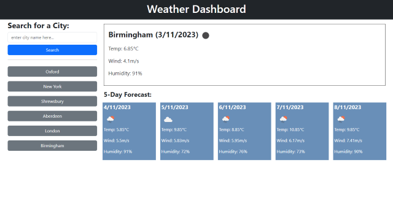

# Weather-Dashboard
Using Javascript (including jQuery) and APIs to create a weather dashboard. This application accepts user input via a search box and fetches weather data for locations via an API and displays it on the page. 
Bootstrap is used for the layout with some custom styles.
Browser localStorage is used to persist the searched location list between visits. 
The DayJS library is used to facilitate date calulations and display.

## Usage

View on GitHub Pages here: [https://webtam81.github.io/Weather-Dashboard/](https://webtam81.github.io/Weather-Dashboard/). 
Enter a city in the search box, then click on search. The forecast will appear on the right. Saved searches will appear in the list below. Click on one of these buttons to see the forecase for that search again.

## License

MIT License. See license file for further details.